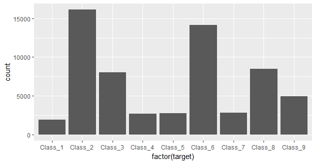
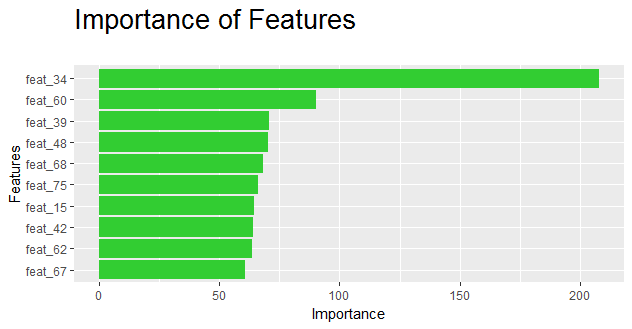

## Otto Group Product Classification Challenge
Quoted from https://www.kaggle.com/c/otto-group-product-classification-challenge/data
```
Each row corresponds to a single product. There are a total of 93 numerical features, which represent counts of different events. All features have been obfuscated and will not be defined any further.
There are nine categories for all products. Each target category represents one of our most important product categories (like fashion, electronics, etc.). The products for the training and testing sets are selected randomly.
```

###Summary of each data fields

* id - an anonymous id unique to a product
* feat_1, feat_2, ..., feat_93- the various features of a product
* target - the class of a product

###Distribution of the class variable
This helps us understand more about our data and possible class imbalance that may pose a problem in doing classification.



###Pre-processing
Before the data was used, we have removed the first variable "id" as it is useless in the classification task and might interfere with the accuracy of the model.
```
data <- data[,-1]
```

We have divided our dataset into testing and training sets in the ratio of 3:7 for most of the algorithm
```
ind <- sample(1:nrow(data), floor(nrow(data)*0.3))
test <- data[ind,]
train <- data[-ind,]
```

Alternatively, down sampling are used in tree.R. Down sampling is used so that the classes in the training set are balanced.
```
ind <- sample(1:nrow(data), floor(nrow(data)*0.3))
test <- data[ind,]
train <- data[-ind,]
train <- downSample(x = train[, -ncol(train)],y = train$target)
```
Based on random forest (tree), we are able to sort out the top 10 feature based on its importance.


Our code is divided into 3 R files
* ANN.R - Artificial neural network (Library used : nnet)
* naiveBayes.R - Naive Bayes model (Library used : klaR)
* tree.R - Decision tree (Library ysed: randomForest, tree, ISLR)

The confusion matrix is plotted in each of the files, for comparison between these algorithms, we will take a look at the area under the curve.

| Algorithm     | Multi-class area under the curve         | Accuracy    |
|---------------|------------------------------------------|-------------|
| ANN           | 0.81                                     | 0.7234      |
| Naive Bayes   | 0.72                                     | 0.6552      |
| Tree          | 0.82                                     | 0.8348      |

Classifiers behave differently because their underlying theory is different.
For instance, neural networks are bad with sparse data and such.
